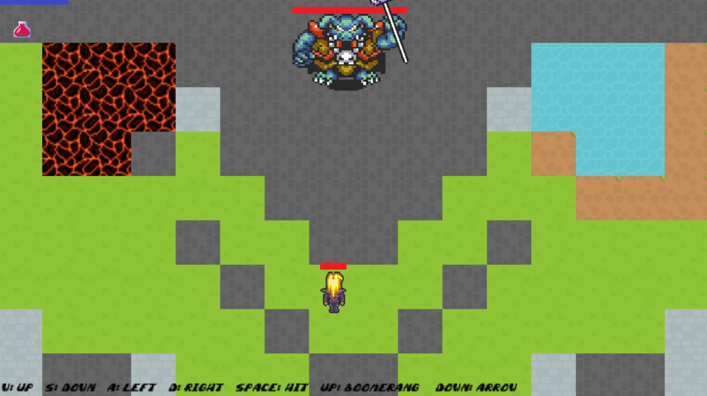
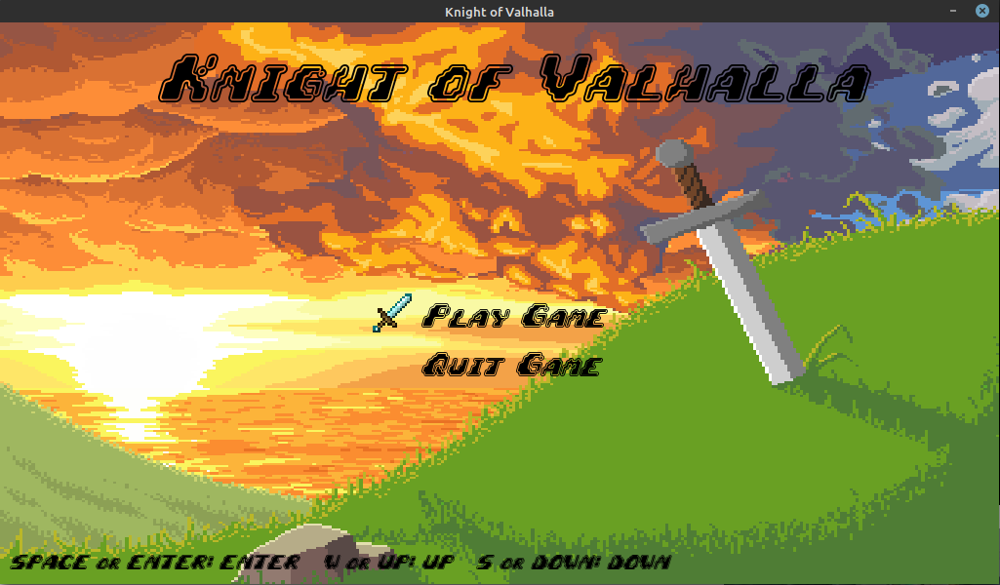
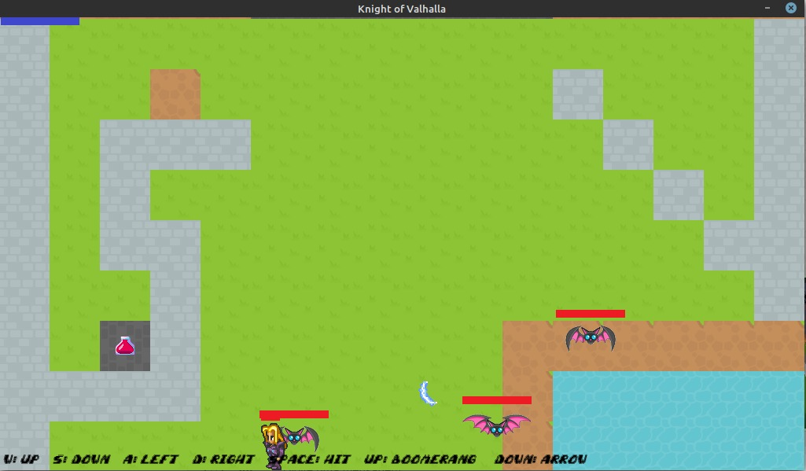
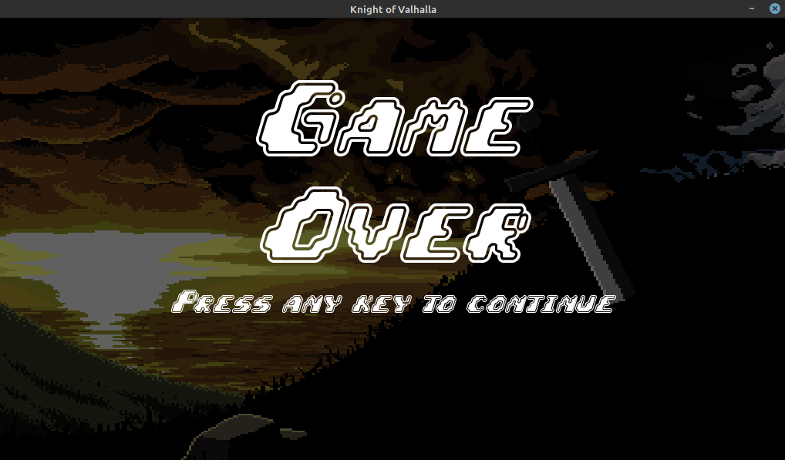

*Knight of Valhalla - Projeto de CES22*
============================================

**Grupo**
1. *Henrique Fernandes*
2. *Éric Bastos*
3. *Vinícius de Pádua*
4. *Due Jie Wan*
5. *Enzo Vargas*
6. *Thomas Castro*
-----------------------

Cuidado ao adicionar arquivos ao repositório.
---------------------------------------------

NÃO USE GIT ADD ., GIT COMMIT -A, etc.
--------------------------------------

Dê um git add em cada arquivo (se tiver vários use git add -i). Isso vai evitar que o repositório fique cheio de lixo. 
Lembre que não tem como apagar o lixo do repositório, ele sempre vai ficar no histórico, então enviar binários por 
exemplo é estritamente proibido.

## Instalando as dependências

- Rode no seu terminal, dentro da pasta main, `python setup.py install`
- Caso não tenha  setuptools, execute o comando `sudo apt-get install -y python-setuptools`

>**Observação:** Dependendo da máquina, nas instruções acima ,deve-se utilizar o comando `python3` no lugar de `python`. Para descobrir qual o comando correto, digite no terminal  `which python` e veja se há um arquivo `bin` que corresponde ao comando. Caso não haja, tente com `which python3` e certifique-se que existe este arquivo.

## Iniciando o jogo

- Para iniciar o jogo, basta executar, estando na pasta da main, o comando `python advancing_hero`

## Instruções para uma boa experiência

- Com o jogo iniciado, o jogador se encontrará na tela de início, podendo tanto iniciar o jogo (**Play Game**), como sair (**Exit Game**):
  

> Os comandos para selecionar podem ser feitos utilizando as teclas **PgUp/W** e **PgDn/S** do teclado. Para clicar basta utilizar as teclas **Space/Enter**.

 - Dentro do jogo, os comandos necessários para ter uma experiência agradável, é necessário ter em mente os seguintes comandos:
  
  > - Para *movimentar* o personagem, utilizamos as teclas:
  >    - **W**: Movimentar para cima
  >    - **A**: Movimentar para a esquerda
  >    - **S**: Movimentar para baixo
  >    - **D**: Movimentar para a direita
  > - Para *atacar* os inimigos, utilizam-se as teclas:
  >    - **PgUp + Espaço**: Lança o bumerangue
  >    - **PgDn + Espaço**: Lança flexas

> **Disclaimer:** Vale a pena notar que o nosso personagem, Ragnar, se movimenta em velocidades diferentes dependendo do ambiente em que pisa. Pode-se notar este fato observando que na água ele se move com maior dificuldade.
- Quando o personagem fica sem "vida" suficiente, o jogo acaba e fica-se com a tela de "Game Over":

- Se desejar reiniciar um outro jogo, basta utilizar qualquer tecla que irá redicionar para a tecla inicial.

## Curiosidades
  - Vale a pena ressaltar os seguintes fatos interessantes: o personagem principal foi inspirado no personagem lendário *Ragnar Lodbrok*, que reinou a Dinamarca e a Suécia durante os séculos VIII e IX.
  

  - As armas utilizadas no jogo foram inspiradas nas armas utilizadas no período medieval
  
  

  - A inspiração para o nome "Valhalla" vem da mitologia nórdica, onde os guerreiros mortos em combate são escolhidos por Odin e levados pelas valquírias para um salão enorme com 540 quartos, situados em Asgard. Lá eles são recepcionados aos outros guerreiros que brindam a sua chegada. É motivo de orgulho para os guerreiros vikings serem selecionados para Valhalla.
  